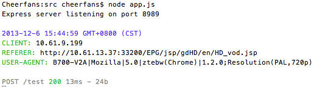

hdTestSuits
===========

HD-STB Test Suits 

一直以来EPG开发一部分工作就是多款机顶盒的适配，实际工作中由于机顶盒浏览器各个厂商有所不同，常常会出现一些莫名的bug，为了定位EPG页面在不同机顶盒上出现的bug问题，特别写了这个小工具，用于抓取机顶盒浏览器抛出的错误信息及我们自定义的调试信息

###基本原理
通过使用所有高清机顶盒都支持的AJAX POST，将服务器上EPG页面try、catch到浏览器报错消息、自定义调试消息POST到客户端，以实现类似桌面浏览器开发者工具(firebug)console的功能。
    
    xmlhttp.open("POST", _debug_server_path, true);
    xmlhttp.setRequestHeader('Content-Type', "application/x-www-form-urlencoded");
    xmlhttp.send("…");

(标清机顶盒原则上也是支持form POST消息的，鉴于目前标清机顶盒版本比较稳定暂时没有考虑通过iframe提交消息这种方式是否适用所有标清机顶盒的问题。)

###配置
解压包放置到你电脑喜欢的位置，打开Terminal进入你放置的路径/src/目录，运行：node app.js
  
    >Cheerfans:hdTestSuits cheerfans$ cd src/
    >Cheerfans:src cheerfans$ node app.js
    >
    >Express server listening on port 8989

打开src/client/patcher.js，编辑文件

    _debug_server_path = "http://10.61.9.49:8989/test",

换成：

    _debug_server_path = "http://你当前电脑的IP:8989/test",

（确保你当前电脑与机顶盒在同一网段能够互访）

将编辑好的patcher.js上传到EPG服务器上，附加到要调试的EPG页面上，或者使用script标签将patcher.js的内容插入到页面。
清理服务器缓存，访问刚编辑过的EPG页面，出现下图消息，工具初始化成功。

###功能
工具在patcher.js自定义了_post方法和log方法：

####初始化消息
    _post("","INIT");
刚看到得初始化成功的消息通过_post方法实现，提醒页面加载成功，工具加载成功。

####一般自定义消息_
    _post("一般自定义消息","NORMAL");
字是黑色的，一般自定义消息。

####节点消息
    _post("节点消息","POINT");
字是蓝色的，用于区别一般自定义消息。

####警告消息
    _post("警告","WARNING");
字是黄色的，用于显示警告消息。

####页面报错消息    
    try{
        throw new Error("Error messages");
    }catch(e){
        _post("错误","ERROR"); 
    }
字是红色的，用于显示错误消息。

####log方法
log方法附加了检测简单对象类型的功能，当参数对象为相应简单的类型，消息会显示显示： *(对象类型)对象的值*

`log("a");`

>(String)a

`log(10);`

>(Number)10

`log(true);`

>(Boolean)true

当对象为object时，log方法会遍历当前数组最上层的所有元素并显示其类型。

`log({"name":"max", "age":21});`

>(Object) => {name:(string)max, age:(number)21} 

`log(["a",1,["c","d"]]);`

>(Array) => {0:(string)a, 1:(number)1, 2:(object)c,d}

